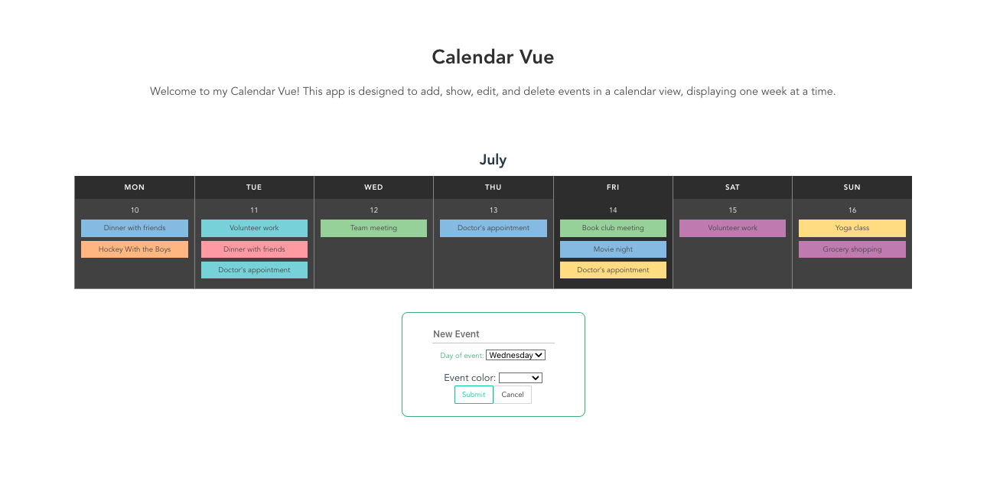

# 📝 Calendar Vue 📝

Welcome to Calendar Vue, a powerful event management application that allows you to seamlessly add, display, edit, and delete events in a simple one-week calendar view. With Calendar Vue, you can effectively organize your schedule and stay on top of important dates.

Calendar Vue offers a range of features to enhance your event management experience. The app presents a clean and intuitive calendar view, displaying events for a single week at a time. Easily create new events by providing a title, selecting the day, and choosing a color to categorize your events. The interactive interface allows you to update event details such as the title and color directly from the calendar view, ensuring that your event information remains up-to-date.

Managing your events is effortless with Calendar Vue. Remove events that are no longer needed with a simple click, keeping your calendar clutter-free. The app provides a user-friendly experience, allowing you to seamlessly navigate and interact with your events.

Feel free to customize and expand upon this description based on your specific app's features and requirements.

## Live Website 🌐

### [Calendar Vue](https://calendar-vue-ten.vercel.app/)

## Developer 🤝

### 🧑‍💻 [David Benner](https://github.com/davebenner14)

## Technologies Used 💻

- [Vue.js](https://vuejs.org/guide/introduction.html)
- [JavaScript](https://developer.mozilla.org/en-US/docs/Web/JavaScript)
- [HTML](https://developer.mozilla.org/en-US/docs/Web/HTML)
- [CSS](https://developer.mozilla.org/en-US/docs/Web/CSS)
- [Bulma](https://bulma.io/documentation/)
- [Font-Awesome](https://fontawesome.com/docs)

## Screenshots 📸



## Getting Started Yourself 🚀

To get started with this project, follow these steps:

First, install Vue CLI, if you haven't already, using the following command:

```
npm install -g @vue/cli
```

Create a new Vue.js project using:

```
vue create <project name>
```

Install the required dependencies:

```
npm install
```

Test your application:

```
npm run serve
```

## CRUD Operations 📚

This code represents a simplified implementation of an event management system using Vue.js. The store object contains reactive state properties and methods for performing CRUD operations on events. It allows you to create, update, and delete events.

The createEvent method adds a new event with a title and color to the state. The updateEvent method modifies the title and color of an existing event. The deleteEvent method removes an event from the state.

```
import { reactive, toRefs } from "vue";

export const store = {
  state: reactive({
    events: [],
  }),

  createEvent(title, color) {
    const event = { title, color, edit: false };
    this.state.events.push(event);
  },

  updateEvent(event, newTitle, newColor) {
    event.title = newTitle;
    event.color = newColor;
    event.edit = false;
  },

  deleteEvent(event) {
    const index = this.state.events.indexOf(event);
    if (index !== -1) {
      this.state.events.splice(index, 1);
    }
  },
};

export default toRefs(store.state);

```

## Going Forward 🚀

Thank you for exploring Calendar Vue, a comprehensive event management application. I appreciate your experience with the app and welcome any feedback or suggestions you may have. Happy coding and enjoy the seamless event management experience with Calendar Vue!
